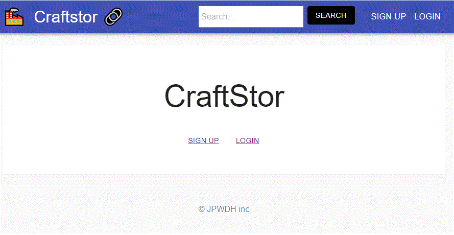

# CraftStor

## Description

LinkedIn for craftspeople. The user can create a profile and also look at other profiles. Provide freelancing services. 

## User Persona
Emily, 26, Craftsperson

## User Story
Emily just moved to a new city and is looking for a new job but doesn’t know how to connect with people in her field in the new city. CraftStor will allow her to post her profile up on the internet so that she can connect with people who are working in the same field.

## Models

* User
	Email
	Name
	Password
	Profile - ID

* Profile
	Skills
	Portfolio
	Projects

* Queries & Mutations
    Get profiles
    Update profiles
    Create User
    Login
    Logout
    
    
## APIs/Libraries/Component-Libraries/Technologies

* React, Express, Mongoose, MongoDB, Apollo, GraphQL, JWT

* CSS Framework
Material
    
   
## Full stack

* Front end: Provider/Consumers/State/Reducer/Actions, Components, User Authentication, queries and mutations, context

* Back end: Server, Database, Models, schemas, authentication, CRUD
   
   
## Portfolio

* [GitHub Repository](https://github.com/jlamonade/craftstor)

* [Deploy](https://craftstor.herokuapp.com/)

    
## Links

* [Material](https://material-ui.com/) React components for faster and easier web development, a library that uses Facebook’s react framework

* [Moment.js](https://momentjs.com/) date format

* [MongoDB Atlas](https://www.mongodb.com/cloud/atlas) MongoDB cloud database service

* [Asana](https://www.asana.com) Project Management Application

* [Figma](https://www.figma.com) Collaborate Product Design